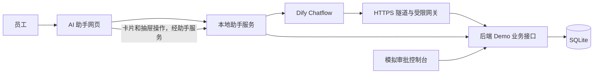

# 智能差旅助手 Demo

通过自然语言创建差旅申请、查询行程与单据、撤回、作废、编辑重提和连续行程变更。当前版本为 **单据生命周期 V2**，包含独立 Dify Chatflow、后端模拟差旅系统和 AI 助手网页。

## 从这里开始

| 内容 | 入口 |
| --- | --- |
| 当前系统需求、业务规则与流程图 | [需求说明](docs/需求说明.md) |
| 在另一台电脑安装、配置和运行 | [部署指南](docs/部署指南.md) |
| 当前 Dify 工作流 DSL | [差旅助手-单据生命周期-V2-可导入.yml](交付物/单据生命周期_Dify/差旅助手-单据生命周期-V2-可导入.yml) |
| Dify 节点、接口契约与构建说明 | [工作流说明](交付物/单据生命周期_Dify/README.md) |
| 日常演示操作 | [差旅助手 V2 使用说明](模拟差旅系统/单据生命周期V2使用说明.md) |
| 本次交付验证结果 | [发布验证](docs/发布验证.md) |

## 三部分分工



- **Dify**：理解问题、提取字段、组织对话，并根据单据原始行程推理回答“明天在哪里出差”等问题。
- **后端 Demo**：管理单据状态、有效版本、变更链、操作资格、模拟审批和幂等回执。
- **AI 助手**：提供会话、统一单据卡片、编辑抽屉和确认弹窗；本地助手服务保存会话与草稿并连接 Dify。

## 当前能力

- 创建普通差旅／短期异地办公申请，补充和修改草稿，确认后生成模拟单据。
- 纯语义查询历史、当前和未来差旅；最多显示 3 张统一卡片，超过时显示总数和查看全部入口。
- S002 撤回、S005 原号编辑重提、当前有效 S004 作废、串行行程变更，以及 S005 未生效变更的终止。
- 按接口返回的 `actions` 展示按钮；上一轮办理按钮置灰；查看系统单据按钮只做演示。
- 支持历史会话、草稿版本校验、重复请求回放和办理结果恢复。
- 模拟台提供演示样例及审批推进。默认部门为“数字化部”，付款公司为“杭州某科技公司”；单号从 `123000001` 递增。

## 部署概览

需要 Python、Node.js、Git、Cloudflare Tunnel，以及已配置模型的 Dify 账号。建议 macOS、Linux 或 Windows WSL2；完整步骤见 [部署指南](docs/部署指南.md)。

```bash
git clone https://github.com/khalilxxxx/autobusinesstrip.git
cd autobusinesstrip/模拟差旅系统
# 按部署指南导入独立 Dify 应用、配置 .local 和 cloudflared 后执行：
./run-lifecycle.sh
```

启动后打开：

- AI 助手：<http://127.0.0.1:8876/assistant>
- 模拟差旅控制台：<http://127.0.0.1:8876/simulator>
- 本地 API 文档：<http://127.0.0.1:8876/docs>

仓库不包含运行数据库、历史会话、模型密钥或本机私密配置。新电脑初始化的是独立环境，可在模拟台点击“添加演示样例”。本项目用于功能演示，尚未接入企业登录、真实审批或报销系统。

## 仓库结构与版本

```text
交付物/
  单据生命周期_Dify/       当前 DSL、构建脚本、提示词和测试
  完整Demo_Dify接入/        创建申请链路源码与原版 DSL；新版仍依赖其中节点
模拟差旅系统/
  frontend/                React / TypeScript AI 助手与模拟台
  mock_travel/             FastAPI 业务、助手服务与网关
  examples/                请求示例和无凭证配置模板
  lifecycle_control.py     V2 服务、网关及隧道控制器
  run-lifecycle.sh          V2 安装依赖、构建并启动
  tests/                   后端测试
docs/                      当前需求、部署指南及历史设计验收记录
```

完整保留 `交付物/完整Demo_Dify接入/`，不能只复制前端和 Python 目录：创建申请抽屉会复用该目录下的校验节点。

原版基线为标签 `demo-baseline-20260913`，提交 `936c625`；V2 在独立分支和独立 Dify 应用中实现。仓库 `main` 展示当前 V2。`docs/superpowers/` 和原版说明中带日期的内容是历史记录，规则与界面以本仓库当前 [需求说明](docs/需求说明.md) 为准。
