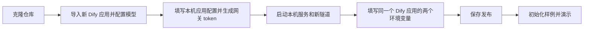

# 在另一台电脑部署差旅助手 V2

本指南部署仓库当前 V2：本机运行 AI 助手和模拟差旅 API，Dify Cloud 运行独立 Chatflow，通过 Cloudflare Tunnel 调用本机受限网关。新电脑使用自己的 Dify 应用、密钥、隧道和数据库。

仓库已包含可导入 DSL、前后端源码、锁定依赖和无凭证配置模板；不包含原电脑的数据库、聊天历史或 `.local` 私密配置。无需启动旧版 8766 / 8767 服务。

## 1. 环境准备

| 项目 | 要求 |
| --- | --- |
| 系统 | macOS、Linux；Windows 使用 WSL2 Ubuntu，在 Linux 家目录中 clone |
| Python | 3.9+；建议 3.11，当前已有验证环境为 3.9.6；需 `venv` 和 `pip` |
| Node.js | 建议 Node 22.16+ 的 22.x 版本，包含 npm；项目使用 Vite 7 与 Vitest 5 |
| Git | 用于 clone 和更新 |
| cloudflared | Cloudflare 官方客户端，本指南使用临时 Quick Tunnel |
| Dify | 可导入 DSL `0.7.0` 的 Chatflow 环境；推荐 Dify Cloud |
| 模型 | 已配置 DeepSeek 提供商和可用额度，当前全部 5 个 LLM 节点使用 `deepseek-v4-flash` |
| 网络 | 本机可访问 npm、Python 包源、Dify API、模型服务与 Cloudflare；Dify 可访问新生成的 HTTPS 隧道 |
| 端口 | 本机 `8876` 和 `8877` 空闲，服务默认只监听 `127.0.0.1` |

Windows 先在 PowerShell 安装 WSL：

```powershell
wsl --install -d Ubuntu
```

之后在 Ubuntu 终端执行本指南 Bash 命令，建议在 `~/projects` 下工作，不放到 `/mnt/c`。控制器使用 `fcntl`、Unix 权限和 `ps`，不支持直接在 Windows 原生 Python / PowerShell 下运行。

检查已安装工具：

```bash
git --version
python3 --version
python3 -m pip --version
node --version
npm --version
```

Ubuntu 如果缺少基础包：

```bash
sudo apt-get update
sudo apt-get install -y git python3 python3-venv python3-pip curl ca-certificates
```

Node.js 请使用 [Node.js 官方安装说明](https://nodejs.org/en/download) 安装满足上表版本的发行版。macOS 可使用已有 Python / Node 安装；Cloudflare 客户端见第 5 步。

## 2. 克隆完整仓库

```bash
git clone https://github.com/khalilxxxx/autobusinesstrip.git
cd autobusinesstrip/模拟差旅系统
```

后续命令除特别说明外，均在 `模拟差旅系统` 目录执行。不要只下载该目录：`交付物/完整Demo_Dify接入/nodes/` 是本地创建抽屉校验的运行依赖；新版 DSL 也已保存在完整仓库中。

## 3. 在 Dify 新建独立应用

1. 打开 Dify 工作室，选择从 DSL 文件导入。
2. 选择仓库文件 `交付物/单据生命周期_Dify/差旅助手-单据生命周期-V2-可导入.yml`。
3. **导入为新应用**，保留名称 `差旅助手-单据生命周期-V2` 和 Chatflow 类型。不要覆盖已有应用。
4. 按导入提示安装 DeepSeek 插件。DSL 声明 `langgenius/deepseek:0.0.24`；在工作区模型供应商设置中配置自己的 DeepSeek API Key。
5. 检查 5 个 LLM 节点的模型均可用：`N03`、`R01`、`N07T`、`LC_ROUTER`、`LC_QA`，当前模型为 `deepseek-v4-flash`。如果自己的账号不能使用该模型，需要在这 5 个节点中选择可用模型，并重新验证语义提取、结构化输出和查询推理；不能只改其中一个。
6. 保存应用，记录编辑页地址 `/app/<应用ID>/workflow` 中的应用 ID。
7. 在该新应用的“访问 API / API 密钥”中创建应用 API Key，用于本地助手调用 Chatflow。

此时两个工作流环境变量仍为空是正常的，第 7 步取得新电脑隧道地址后再填写并发布。导入后的拓扑应为 **55 个节点、93 条边**。

三种凭证用途不同：

| 配置 | 放置位置 | 用途 |
| --- | --- | --- |
| DeepSeek 模型 API Key | Dify 工作区模型供应商设置 | Dify 调用模型 |
| Dify 应用 API Key | 本地 `.local/lifecycle-dify.json` 的 `api_key` | 本地助手调用新 Chatflow |
| 网关随机 token | 本地 `.local/lifecycle-bridge.json` 与 Dify `DEMO_API_TOKEN` | Dify 调用本机网关 |

Dify 自建版也可对接，但需支持该 DSL 版本、对应模型插件、Chatflow 的聊天接口，以及读取和更新会话变量接口。将 `base_url` 改成自己的 Service API 地址，远程地址使用 HTTPS；本机 `http://127.0.0.1/.../v1` 仅适用于本地 Dify。自建 Dify 的 Docker 服务不由本仓库安装或管理。

## 4. 准备本地私密配置

创建配置目录并复制空模板。`cp -n` 保留已有配置；重复部署时应核对已有文件，不用模板覆盖：

```bash
mkdir -p .local/bin
chmod 700 .local
cp -n examples/lifecycle-dify.example.json .local/lifecycle-dify.json
cp -n examples/lifecycle-bridge.example.json .local/lifecycle-bridge.json
chmod 600 .local/lifecycle-dify.json .local/lifecycle-bridge.json
```

使用文本编辑器打开 `.local/lifecycle-dify.json`，只填写／核对：

- `app_id`：第 3 步新应用的 ID，不是 WebApp 分享 ID。
- `expected_app_name`：保持 `差旅助手-单据生命周期-V2`，须与 Dify 应用名一致。
- `base_url`：Dify Cloud 为 `https://api.dify.ai/v1`，不是 `cloud.dify.ai` 编辑页或 `udify.app` 分享页。
- `api_key`：该新应用的 API Key。
- `inputs`：保持 `{}`。

然后执行以下命令，将新应用 ID 同步到网关配置，并生成本机独立 token；已有 token 会保留。命令不输出密钥：

```bash
python3 - <<'PY'
import json
import os
from pathlib import Path
import secrets

dify = json.loads(Path('.local/lifecycle-dify.json').read_text(encoding='utf-8'))
assert dify.get('app_id', '').strip(), '请先填写新应用 app_id'
assert dify.get('api_key', '').strip(), '请先填写新应用 api_key'
path = Path('.local/lifecycle-bridge.json')
bridge = json.loads(path.read_text(encoding='utf-8'))
bridge.update(app_id=dify['app_id'], upstream_url='http://127.0.0.1:8876')
bridge['token'] = bridge.get('token') or secrets.token_urlsafe(32)
bridge.setdefault('public_url', '')
path.write_text(json.dumps(bridge, ensure_ascii=False, indent=2) + '\n', encoding='utf-8')
os.chmod(path, 0o600)
print('网关配置已准备好；凭证未输出。')
PY
```

两份配置的 `app_id` 必须相同，网关的 `upstream_url` 固定为 `http://127.0.0.1:8876`。`public_url` 由控制器首次启动时填写，无需从原电脑复制。控制器会拒绝旧版应用 ID 和权限过宽的配置文件。

## 5. 安装本工作目录的 cloudflared

控制器要求 `.local/bin/cloudflared` 存在且可执行；仅把客户端安装到系统 PATH 还不够。

macOS 使用 Homebrew：

```bash
brew install cloudflared
ln -s "$(command -v cloudflared)" .local/bin/cloudflared
.local/bin/cloudflared --version
```

如果系统已经安装 cloudflared，跳过安装命令，只创建软链接。若该链接已经存在，核对 `--version` 正常即可，不重复创建。

Linux / WSL2 可下载官方对应架构的客户端：

```bash
case "$(uname -m)" in
  x86_64) lifecycle_cf_asset=cloudflared-linux-amd64 ;;
  aarch64|arm64) lifecycle_cf_asset=cloudflared-linux-arm64 ;;
  *) echo "请从 Cloudflare 官方发布页选择本机架构"; exit 1 ;;
esac
curl -fL "https://github.com/cloudflare/cloudflared/releases/latest/download/${lifecycle_cf_asset}" -o .local/bin/cloudflared
chmod 700 .local/bin/cloudflared
.local/bin/cloudflared --version
```

官方下载与安装资料：[cloudflared 发布页](https://github.com/cloudflare/cloudflared/releases)、[Cloudflare 安装说明](https://developers.cloudflare.com/cloudflare-one/connections/connect-networks/downloads/)。Quick Tunnel 无需 Cloudflare 账号，适合临时演示。

## 6. 安装依赖并启动本地 V2

```bash
./run-lifecycle.sh
```

脚本会创建本目录 `.venv`、按 `requirements.lock.txt` 安装 Python 依赖，在 `frontend` 执行 `npm ci` 和构建，然后启动独立链路：

| 服务 | 地址或文件 |
| --- | --- |
| AI 助手与模拟 API | `127.0.0.1:8876` |
| Dify 受限网关 | `127.0.0.1:8877` |
| HTTPS 临时隧道 | 启动输出中的 `https://…trycloudflare.com`，指向 8877 |
| V2 数据库 | `data/lifecycle.sqlite3`，其他助手运行数据也位于 `data/` |
| 进程身份记录 | `.local/lifecycle-processes.json` |
| 本机运行 DSL | `.local/差旅助手-单据生命周期-V2-本机运行.yml` |
| 日志 | `.local/lifecycle-server.log`、`lifecycle-gateway.log`、`lifecycle-tunnel.log` |

启动脚本结束后服务在后台继续运行。控制器只管理自己记录且身份匹配的进程，不会停止占用端口的其他程序。

## 7. 连接 Dify 环境变量并发布

回到**第 3 步刚导入的同一个 V2 应用**，设置：

| Dify 环境变量 | 值 |
| --- | --- |
| `DEMO_API_BASE_URL` | 第 6 步输出的本机新 HTTPS 隧道地址，不加末尾 `/` |
| `DEMO_API_TOKEN` | `.local/lifecycle-bridge.json` 中 `token` 的原文；类型保持 Secret |

在本机编辑器中查看 token 并填入 Dify，不把它提交到 Git。然后保存并**发布应用**，本地助手的 Service API 调用使用已发布内容。

控制器生成的“本机运行 DSL”已经带入真实隧道和 token，是私密运行文件。通常只需修改已导入新应用的两个环境变量，不必再次导入一个应用；公开仓库使用的是环境变量为空的“可导入”版。



## 8. 验证与开始演示

先检查本地服务和 Dify 应用身份。以下命令只查询状态，不提交差旅单据，也不会调用模型：

```bash
curl -fsS http://127.0.0.1:8876/health
.venv/bin/python lifecycle_control.py status
.venv/bin/python -m mock_travel.dify_probe --config .local/lifecycle-dify.json
```

Dify 检查应返回 `status: passed`，只说明鉴权、应用信息与参数检查通过；完整语义链路还要在助手中发起查询验证。

打开：

- [AI 助手](http://127.0.0.1:8876/assistant)
- [模拟控制台](http://127.0.0.1:8876/simulator)
- [本地 API 调试](http://127.0.0.1:8876/docs)

新数据库没有申请单。在模拟台点击“添加演示样例”，或在本机执行：

```bash
curl -fsS -X POST http://127.0.0.1:8876/mock/v1/lifecycle/seed
```

空库首次生成 9 张覆盖历史、当前停留、未来、待审批、审批中、退回、在途变更和已转报销等状态的模拟单据。申请与变更共用单号序列；空库从 `123000001` 开始。重复初始化返回 `created: 0`，不会重复添加或重置已有单据。

样例日期以首次初始化当天的 `Asia/Shanghai` 时间生成；数据库不会每天重新生成日期。当前电脑已有的 30 张演示单据及历史会话不随 Git clone 复制，新电脑从自己的样例开始。

建议按顺序演示：

1. “查一下我的差旅单据”：简短统计和至多 3 张统一卡片，按钮由业务接口返回。
2. “明天我在哪里出差”：根据批准行程回答停留／移动城市，并给出对应卡片。
3. 查询待审批申请，点击撤回并二次确认，再编辑重提，检查原号保留。
4. 查询已完成的未来差旅，说“我要变更这张行程，改成去北京”，核对草稿并提交。
5. 模拟台对新变更依次“模拟开始审批”“模拟审批完成”，再查询当前版本。
6. 对具备资格的有效单点击作废，或明确用对话描述作废目标和选填原因。

“查看系统单据”和“查看全部查询结果”仅用于展示按钮，无真实跳转，这是本期预期行为。

## 9. 停止、重启与更新

查看和停止：

```bash
.venv/bin/python lifecycle_control.py status
./stop-lifecycle.sh
```

停止会一并停止本控制器管理的 V2 后端、网关和隧道，数据库保留。再次启动：

```bash
./run-lifecycle.sh
```

**Quick Tunnel 重建后通常会获得新域名。每次停止／重启或电脑重启后，核对输出地址，更新 Dify 的 `DEMO_API_BASE_URL` 并再次发布。** 网关 token 保存在本地，通常不变。服务健康不代表 Dify 中的旧隧道地址仍可用。

更新仓库代码前先停止服务，再回到仓库根目录执行 `git pull --ff-only`，然后回到 `模拟差旅系统`：

```bash
.venv/bin/python -m pip install -r requirements.lock.txt
./run-lifecycle.sh
```

显式安装锁定依赖可覆盖依赖版本更新；`run-lifecycle.sh` 会重新安装和构建前端。若本次版本更新也修改了 DSL，需要在你的独立 V2 应用中同步 DSL 变化、保留本机两个环境变量、检查模型后重新发布，Git 更新不会自动修改 Dify。

## 10. 数据与迁移

- `data/` 保存模拟单据、请求回执、会话与草稿；停止服务不会清空。
- `.local/` 保存本机配置、日志和进程身份；已被 Git 忽略。
- 如需把现有数据迁到另一台机器，在停止服务后私下备份并复制完整 `data/`。使用同一 Dify 应用才可能继续关联原 Dify 会话；更换应用后请新建本地会话，避免沿用不匹配的会话 ID。
- 不复制原电脑的 `.venv`、`node_modules`、PID 文件或 `cloudflared` 二进制到不同系统；在新机重新安装，按指南生成本机配置。
- 备份数据不需要上传 Git。不要直接删库来“刷新样例日期”；需要新演示环境时可另行 clone 并配置，确保端口和现有环境不冲突。

当前控制器为固定端口的单机演示入口，不包含固定域名隧道、多人在线权限或生产服务部署。若需长期公网部署，应另行配置受控网关和服务管理；不要直接把 8876 管理界面暴露到公网。

## 11. 常见问题

| 现象 | 检查与处理 |
| --- | --- |
| 找不到 `python3` 或 `ensurepip/venv` | 安装 Python；Ubuntu 安装 `python3-venv`，再创建虚拟环境 |
| npm 报 Node 版本不支持 | 使用 Node 22.16+ 的 22.x 版本，执行 `npm ci` |
| 缺少 `.local/bin/cloudflared` | 按第 5 步放置可执行文件或有效软链接 |
| 配置权限过宽 | `chmod 600 .local/lifecycle-dify.json .local/lifecycle-bridge.json`；WSL 项目放 Linux 家目录 |
| 应用 ID 不一致或应用名不符 | 两份配置使用新应用同一 ID；Dify 应用名与 `expected_app_name` 一致 |
| 8876 / 8877 被占用 | 核对占用进程；控制器不会接管或杀死其他进程。不要混用 `run-demo.sh` |
| 本地健康但聊天 401 / 403 | 核对 Dify 应用 API Key；工作流 HTTP 节点 401 则核对网关 token，两者不同 |
| 提示应用未发布 | 在新 Dify 应用保存并发布；仅保存草稿不够 |
| 模型不存在／供应商未配置 | 配置 DeepSeek 密钥、额度和全部 5 个 LLM 节点模型 |
| 无法生成 Quick Tunnel | 检查 `.local/lifecycle-tunnel.log` 和网络；Cloudflare Quick Tunnel 可能受代理或现有 `~/.cloudflared/config.yaml` 配置影响，按官方说明核对，不删除其他项目配置 |
| Dify HTTP 节点超时或返回隧道错误 | 核对新域名、隧道进程、8877 网关、两个环境变量及已发布版本 |
| 页面显示“尚未构建”或资源 404 | 在 `frontend` 执行 `npm ci && npm run build`，或重新运行启动脚本 |
| 查询没有样例 | 模拟台点击“添加演示样例”；“明天”的匹配也取决于首次生成日期 |
| 办理结果未知 | 按原请求号查询办理结果；不要换新请求号重复提交 |

## 12. 开发验证和 DSL 重建

安装和构建命令：

```bash
python3 -m venv .venv
.venv/bin/python -m pip install -r requirements.lock.txt
cd frontend
npm ci
npm run build
cd ..
```

现有自动验证使用临时数据库，不需要模型密钥或正在运行的服务：

```bash
.venv/bin/python -m pytest -q
cd frontend
npm test
cd ../..
模拟差旅系统/.venv/bin/python -m unittest discover -s 交付物/单据生命周期_Dify/tests -v
```

最后一个 `cd ../..` 从 `frontend` 回到仓库根目录。若需根据源码重建新版 DSL，在仓库根执行：

```bash
模拟差旅系统/.venv/bin/python 交付物/单据生命周期_Dify/build_dsl.py
```

构建只读复制原版 DSL 并组装新节点，不修改原版文件，也不会自动导入或发布线上应用。`build_manifest.json` 记录源文件和产物 SHA-256、节点和连线数量。可分享 DSL 中的 `DEMO_API_BASE_URL` 与 `DEMO_API_TOKEN` 应始终为空。

本仓库的实测环境与本次交付验证记录见 [GitHub 交付验证](发布验证.md)。macOS 已有真实 Dify 联调记录；Linux / WSL2 的步骤按现有 POSIX 启动依赖整理，未声称已在所有平台完成端到端测试。
