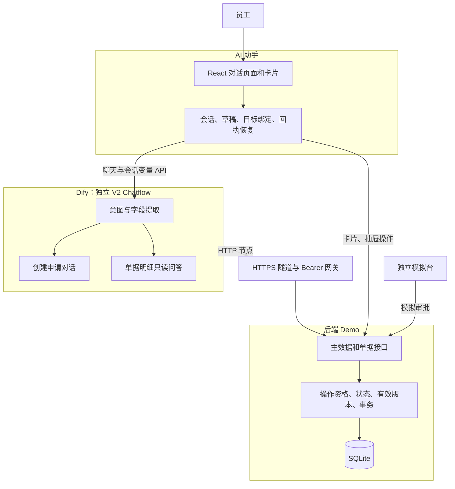
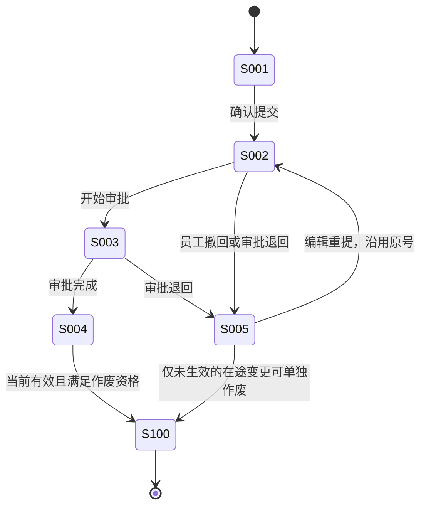
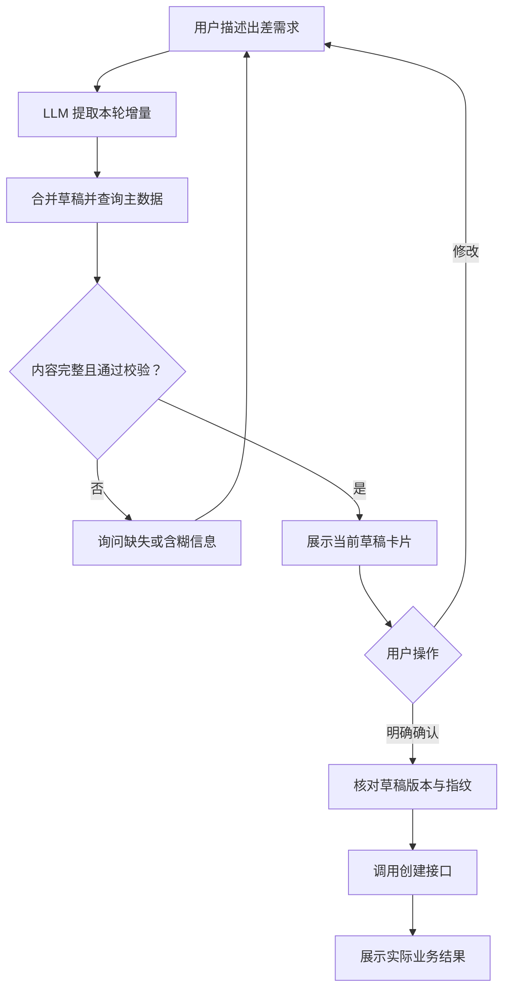
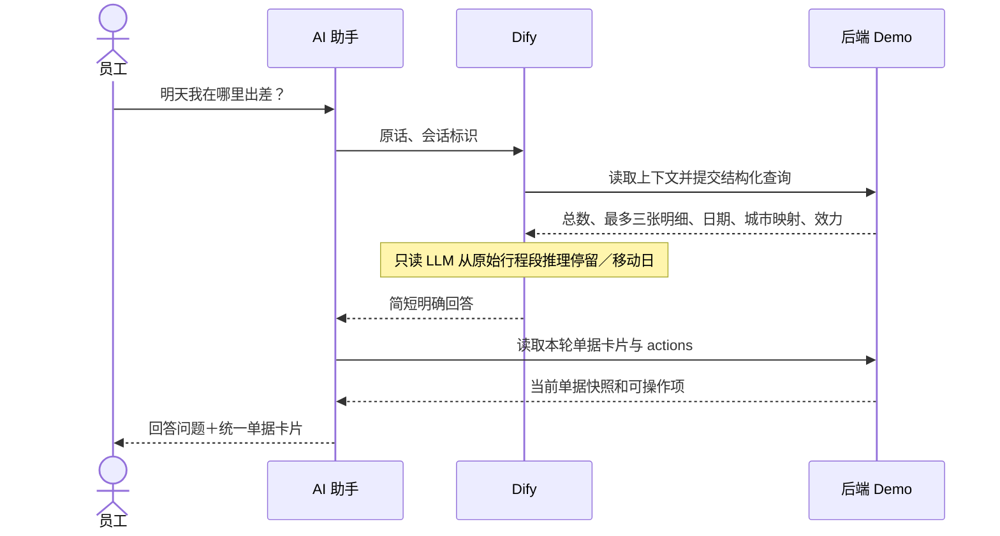
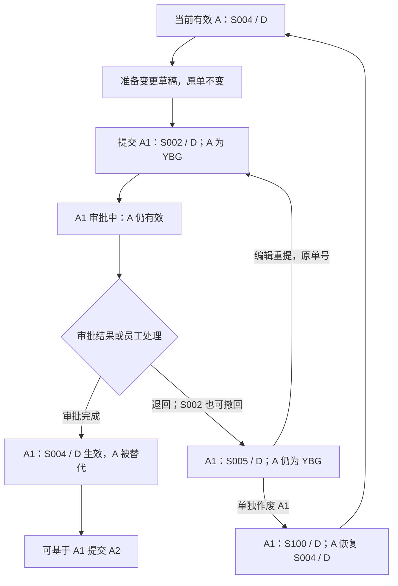
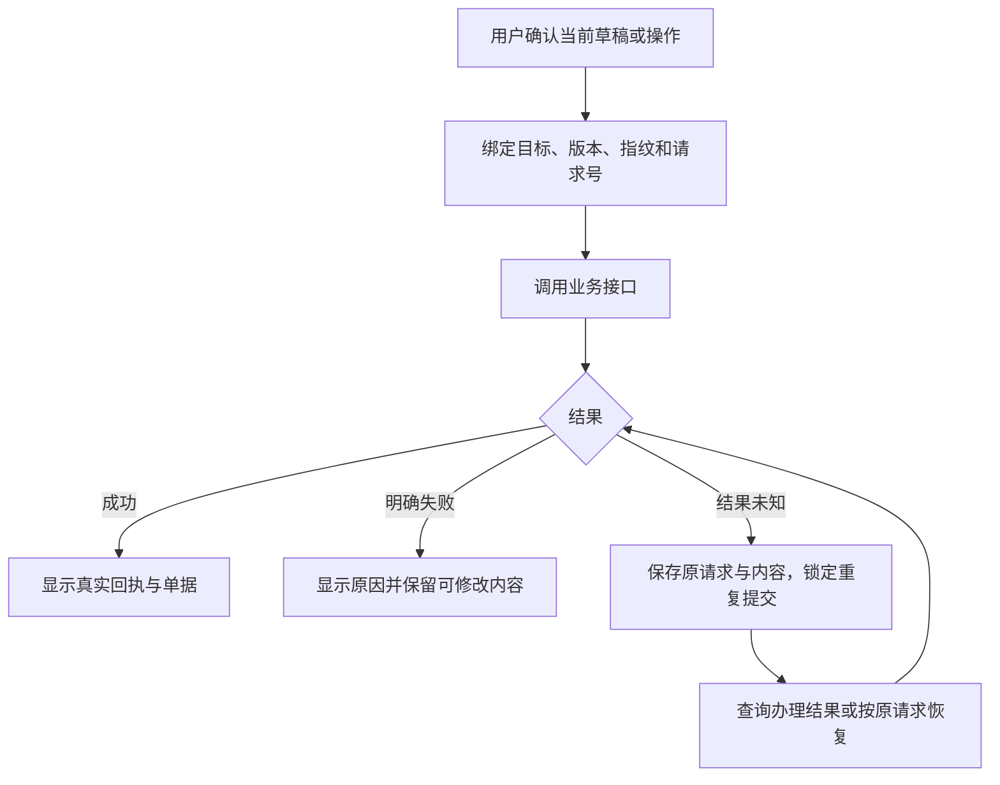

# 智能差旅助手 Demo：当前系统需求说明

更新日期：2026-09-14。范围：单据生命周期 V2，包含创建申请、查询、撤回、作废、编辑重提和行程变更，以及用户最新确认的卡片与对话交互。本文件汇总当前有效需求；历史设计和验收记录保留在 `docs/superpowers/`，发生冲突时以本文件为准。

## 1. 目标、角色与范围

员工通过一句自然语言发起查询或办理，在卡片中核对单据，在对话或抽屉中补充修改，并取得差旅系统的真实模拟回执。自然语言负责理解与解释，业务接口负责决定能否办理和实际结果。

| 角色 | 能力与边界 |
| --- | --- |
| 员工 | 创建、查询自己的单据，按返回资格撤回、作废、变更、编辑重提 |
| 演示操作者 | 在独立模拟台添加样例、推进审批、退回，以及设置创建申请成功／失败场景 |
| AI 助手 | 理解和辅助办理，不代替审批人作出审批决定 |

当前使用固定演示员工 `DEMO_EMP_001`，默认常驻城市杭州，默认部门“数字化部”、付款公司“杭州某科技公司”。主数据包含普通差旅／短期异地办公、50 个国内城市样本及 21 项交通选项。无 M5 切换、企业登录、住宿或同行人模块。

本期不实现报销操作。实际业务允许变更审批期间原单转报销，本 Demo 不通过增加审批期间报销限制来改变这一规则；接口已有的 `YBX` 标记用于判断本次撤回、变更等操作资格。

## 2. 系统分工

三部分属于同一 Demo，但职责独立。AI 助手服务与模拟差旅业务服务目前部署在同一个 FastAPI 进程内，逻辑上分开。

| 部分 | 负责 | 主要代码／交付物 |
| --- | --- | --- |
| Dify | 创建对话、意图和字段提取、路由、查询明细只读推理、简洁回答 | `交付物/单据生命周期_Dify/`，复用 `交付物/完整Demo_Dify接入/` 创建节点 |
| 后端 Demo | 员工／城市／交通主数据，单据持久化、状态、效力、版本链、操作资格、审批模拟、事务和回执 | `模拟差旅系统/mock_travel/lifecycle*.py`、`store.py`、`catalog.py`、`workflow_api.py` |
| AI 助手 | 网页会话与卡片、抽屉和弹窗；服务端保存会话和草稿、绑定办理对象、控制轮次、连接 Dify、恢复结果 | `模拟差旅系统/frontend/`、`assistant_api.py`、`assistant_store.py`、`lifecycle_assistant.py`、`draft_forms.py` |
| 接入设施 | 仅把 Dify 所需接口经 HTTPS 暴露；管理本机服务、网关和隧道 | `gateway.py`、`lifecycle_control.py` |

Dify 的 Code 节点不联网，由 HTTP 节点调用接口；LLM 不生成单号、审批结果或操作成功回执。网关只开放固定业务路径，不开放模拟审批、种子、管理页面、会话列表或任意转发。

## 3. 单据模型与状态

### 3.1 单据与版本

| 概念 | 定义 |
| --- | --- |
| 差旅申请单 `APPLICATION` | 用户首次提交的单据 |
| 行程变更单 `CHANGE` | 基于当前有效批准单创建的新单据；有独立单号 |
| 单号 `applicationNo` | 申请、变更和样例共用递增序列，从 `123000001` 开始；编辑重提沿用原号 |
| 单据版本 `version` | 状态或业务数据变动时递增，用于提交时检查并发冲突 |
| 提交轮次 `submissionRound` | S005 编辑重提时递增，原单号和历史记录延续 |
| 前序和根 `predecessorId/rootId` | 串行变更链中的直接前序与最初申请 |
| 当前有效单 `currentEffectiveId/isEffective` | 当前批准安排的权威指向；不能单凭 `tflag` 推断 |
| 本地草稿 `draftId/revision/fingerprint` | 尚未提交的编辑快照；与正式单据版本分开 |

### 3.2 状态定义

| 状态 | 含义 | 员工办理含义 |
| --- | --- | --- |
| S001 | 草稿 | 创建编辑阶段；Demo 中未提交草稿保存在助手状态，不预先生成正式单号 |
| S002 | 已提交，尚无人审批 | 可撤回本次提交 |
| S003 | 审批中，已有人员审批 | 不可员工直接撤回；由模拟台正常退回 |
| S004 | 审批完成 | 是否允许作废／变更，还需检查当前效力、tflag 和在途变更 |
| S005 | 撤回／退回 | 可编辑重提，沿用原单号，审批记录连续 |
| S100 | 已作废 | 无需额外审批；不可恢复，也不会恢复旧版 |

普通 S005 申请不能作废。上图的 S005 → S100 仅用于终止未生效变更。S004 发起变更是创建另一张 S002 单，不是把原单状态改成 S002。

### 3.3 tflag 与效力

| tflag | 业务含义 |
| --- | --- |
| D | 待报销；未转报销且本单尚未提交后续变更 |
| YBX | 已转报销 |
| YBG | 已提交后续行程变更 |

以原批准单 A 和其新变更 A1 为例，以下为用户最后确认的规则：

| 事件 | A 的状态 / tflag | A1 的状态 / tflag | 当前有效安排 |
| --- | --- | --- | --- |
| 仅准备本地变更草稿 | S004 / D | 尚无正式新单 | A |
| 变更提交 | S004 / YBG | S002 / D | A |
| 变更进入审批 | S004 / YBG | S003 / D | A |
| 变更撤回／退回 | S004 / YBG | S005 / D | A |
| 变更编辑重提 | S004 / YBG | S002 / D，沿用 A1 单号 | A |
| 变更审批完成 | S004 / YBG，已被替代 | S004 / D | A1 |
| S005 变更单单独作废 | S004 / D | S100 / D | A，可重新发起变更 |
| A1 已生效且符合条件后作废 | A 保持被替代 | S100 / D | 无，不恢复 A |

`YBG` 同时会出现在“原单仍有效、变更在途”和“原单已被替代”两种阶段，因此效力必须由业务系统显式返回。

## 4. Dify 需求

### 4.1 独立应用与创建申请

应用名为 `差旅助手-单据生命周期-V2`，应用类型为 Chatflow（DSL 中 `advanced-chat`），当前可导入 DSL 包含 55 个节点、93 条边。旧工作流保留不变，新功能不在旧应用中覆写发布。

创建申请继续支持逐轮补充事由、差旅类型、城市、日期、交通与行程段；城市和交通来自接口主数据。缺字段或指代含糊时继续澄清。形成草稿后，用户可以语义修改或打开抽屉编辑，明确确认后才提交。

### 4.2 生命周期路由

生命周期入口先读取本轮上下文，再识别查询、详情、撤回、作废、变更、重提、修改、确认或放弃本地编辑。已处理的生命周期请求不进入创建提交链；普通新申请才回到原创建链。创建草稿和生命周期草稿分别管理，不能含糊地确认两份草稿或覆盖另一份编辑中的草稿。

LLM 只提取允许的意图、引用、展示序号、查询条件和显式修改。用户标识和请求标识来自系统变量；确认对象、revision 与 fingerprint 来自服务端当前上下文，不能由模型编造。

### 4.3 查询与语义推理

- 输入全部使用自然语言，无查询条件界面。
- 可查询过去、现在、未来的出差、指定日期／城市／单号、单据当前状态及对应差旅申请。
- “历史差旅”指过去日期的差旅；“历史版本”指已被后续变更替代的旧单。这两者不同：前者可以查，后者不在员工查询中展示。
- 旧号可以关联到当前版本；办理动作不因查询重定向而静默操作另一个目标。
- 普通查询只回答统计或结论，如“已为你查询到 1 张单据信息，详见下方卡片。”
- “明天在哪里出差”等问题由只读 LLM 根据接口返回的单据原始 `request.trips`、城市映射、业务日期、单据状态与效力推理。没有“明天在哪里”的专用业务接口供模型直接取答案。
- 跨交通段推断停留日，移动日说明起止城市；未批准、已作废或相互冲突的安排不能说成已经确定的实际位置。
- 后端内部可计算日期范围以筛选候选单据；交给问答节点的事实去除 `locations/stay` 等预推理字段，保留原始明细。
- 一轮最多展示和分析 3 张单据。超过时说明总数和当前展示数量／范围，不能声称分析了未提供的其他单据。
- 无结果明确告知；缺少可靠上下文或问答失败时使用已取得的基础查询回复，不重新执行办理接口。

## 5. 后端 Demo 需求

### 5.1 操作资格是接口责任

响应 `actions` 中每项提供 `allowed` 和不可操作原因 `reason`。前端按接口结果展示按钮，后端在实际操作时再次校验。以下矩阵便于说明规则，不替代调用接口：

| 操作 | 资格 | 成功结果 |
| --- | --- | --- |
| 撤回 `withdraw` | 当前员工未被替代、未转报销的 S002 单 | S005，保留原号及流程记录 |
| 编辑重提 `resubmit` | S005 普通申请；或前序仍有效的 S005 在途变更 | 原号 S002，提交轮次增加 |
| 行程变更 `change` | 当前有效 S004 / D，且无在途变更 | 新建 S002 / D 变更单；前序 YBG |
| 作废有效单 `void` | 当前有效 S004 / D，且无在途变更 | 原单 S100，不恢复旧版 |
| 终止变更 `void` | S005 的当前在途变更，前序仍有效 | 变更 S100 / D，前序恢复 D |

在途变更包括 S002、S003 和 S005。S005 只是可以继续编辑的撤回／退回状态，仍占用变更链。操作原因均选填，作废不增加审批。

### 5.2 串行行程变更与终止

只有当前有效版本可以作为下一张变更的前序。允许 A → A1 → A2 持续变更，但 A1 必须先审批完成并生效，才能基于 A1 提交 A2，不允许并行变更。

有在途变更时不允许直接作废原单。S002 变更先撤回；S003 变更需审批人退回；进入 S005 后再单独作废变更，最后重新判断原单能否作废。即使 A1 已是 S005，也不能跳过单独作废 A1 的步骤。

变更允许修改日期、城市、交通、行程段、事由、差旅类型、部门和付款公司，未明确修改的字段继承原单。简单往返“把去上海改为去北京”同时更新去程到达城市和返程出发城市；复杂行程或修改范围不明确时先澄清。

### 5.3 数据、校验与异常

- 所有单据、有效版本指向、状态变更和回执持久化到 SQLite；关联更新在同一事务内完成。
- 检查对象归属、动作资格、原单版本和提交内容；变更／重提校验字段、日期、城市、交通和路线关系。
- 同一 `clientRequestId` 和相同请求内容返回原回执；同请求号换内容产生冲突，不再生成另一张单据。
- 同一草稿成功提交后的重复请求不重复成单；模拟创建成功／失败开关只影响新的请求。
- `SUCCEEDED`、`FAILED`、`UNKNOWN` 分开处理。“查询不到回执”不等于办理失败；网络中断也不能直接承诺未办理。
- 版本冲突时保留输入，读取最新对象重新核对；不能把办理目标自动切换到替代的新单。
- 审批记录在业务内部和模拟台保留，员工查询卡片不展示审批历史。

## 6. AI 助手需求

### 6.1 统一卡片与简洁回答

所有正式差旅单据使用同一种完整卡片，无论单条还是多条查询。卡片包含单号、时间范围、当前单据状态、事由、差旅类型、部门、付款公司及各行程段。路线表达如“杭州 → 北京 → 杭州”。同一行程段出发和到达同日只显示一个日期，跨日显示起止日期。

卡片不展示审批流信息，也没有“查看详情”按钮。每张正式卡片保留“查看系统单据”演示按钮；超过 3 条时另有“查看全部查询结果”。本 Demo 不实现这些按钮的真实跳转。

文字只回答问题、说明已完成的处理或必要澄清，避免重复卡片中的明细、组织信息、单据版本和技术字段。例如：

| 场景 | 对话示例 |
| --- | --- |
| 单条查询 | 已为你查询到 1 张单据信息，详见下方卡片。 |
| 多于三条 | 共查询到 8 张单据，目前展示最近的 3 张，详见下方卡片。 |
| 停留日问题 | 按已批准行程，明天你在上海出差，详见下方差旅申请。 |
| 变更草稿 | 已准备变更草稿，将原去上海的往返行程改为北京，详见下方草稿卡片。 |

### 6.2 办理交互

| 功能 | 交互 |
| --- | --- |
| 撤回 | 卡片按钮或语义提出后，二次明确确认再办理 |
| 作废 | 卡片按钮打开弹窗，显示影响说明、选填原因、取消和确认；没有“用对话说明”按钮 |
| 语义作废 | 明确指令且目标唯一可直接办理；支持同时描述原因。否定、暂缓和“能否作废”的询问不执行 |
| 变更／重提 | 生成实际修改后的草稿卡片，可用语义继续修改或打开抽屉 |
| 编辑抽屉 | 只展示当前草稿，交互与创建申请一致；不展示前后差异，不提供“保存并查看差异” |
| 抽屉提交 | 有未保存输入时先保存、校验，使用返回的新 revision / fingerprint 提交 |

同轮既修改又语义确认时只保存新草稿，等待再次确认；抽屉“确认提交”则以当前可见表单作为明确提交内容。多单据时要求明确单号、展示序号或当前唯一选择，不猜办理对象。

### 6.3 轮次、会话与恢复

用户发起新一轮时，上一轮所有办理按钮立即置灰，包括撤回、作废、变更、编辑和确认提交；查看系统单据入口保持可用。刷新或切换历史会话也不能重新激活过期按钮，服务端还会检查实际目标和版本。

输入框上方不常驻“继续编辑变更”等按钮、提示条或提交结果区；编辑从对应草稿卡片进入。必要的错误或办理结果恢复提示出现在对话反馈或编辑抽屉中。

新会话、历史会话、消息和草稿由本地服务持久化。同一会话请求串行处理；页面刷新不丢草稿，不把“正在处理”误报成成功。恢复必须沿用原业务请求标识，不能因另一次 Dify 运行生成新号而重复办理。

## 7. 接口边界

以下是 Demo 接口，企业对接时应映射到正式差旅接口，不把本地路径当作企业现有协议。

| 调用方 | 接口 | 用途 |
| --- | --- | --- |
| Dify | `GET /workflow/v1/lifecycle/context` | 读取生命周期上下文 |
| Dify | `POST /workflow/v1/lifecycle/turn` | 执行校验后的本轮生命周期命令 |
| Dify 创建链 | `/workflow/v1/context`、`/workflow/v1/cities/resolve`、`/mock/v1/travel/applications` 等 | 主数据、创建及回执 |
| AI 助手 | `/assistant/api/conversations`、`/assistant/api/turns` | 会话和消息任务 |
| AI 助手 | `/assistant/api/conversations/{id}/lifecycle/*` | 卡片状态、草稿、动作与确认 |
| 后端 Demo | `/mock/v1/lifecycle/documents`、`.../{reference}/actions`、`/mock/v1/lifecycle/receipts/{id}` | 查询、业务动作和回执 |
| 模拟台 | `POST /mock/v1/lifecycle/documents/{reference}/approval` | 模拟开始审批、完成、退回 |
| 模拟台 | `POST /mock/v1/lifecycle/seed` | 幂等添加样例，不重置已有数据 |

业务接口通常使用 `{uuid, code, message, data}` 信封，成功还需检查业务 `code`；助手 API 使用直接 JSON 和 `{error:{code,message,details?}}`。详细运行契约以本地 `/openapi.json` 和 [Dify 工作流说明](../交付物/单据生命周期_Dify/README.md) 为准。

## 8. 演示验收与后续正式对接

| 场景 | 预期 |
| --- | --- |
| 创建、修改并提交 | 卡片与模拟台显示同一单号；重试不重复成单 |
| 查询过去、未来及“明天在哪里” | 简短回答，至多 3 张统一卡片，状态和推理有据可依 |
| S002 撤回再重提 | S005 → S002，原单号和连续记录保留 |
| A 提交 A1，A1 尚未生效 | A 仍有效，A 为 YBG；不能并行变更或直接作废 A |
| A1 完成后提交 A2 | 当前有效版本逐次替代，旧版不出现在员工结果中 |
| A1 退回后单独作废 | A1 为 S100 / D，A 恢复 D；可重新变更或作废 A |
| 作废最新有效版 | 成功即 S100；无旧版恢复 |
| 新轮次与版本冲突 | 旧按钮禁用，服务端拒绝过期办理 |
| 网络异常 | 不误报成功／失败，保留原请求并恢复结果 |

当前 Demo 不包含企业账号与权限系统、真实主管审批集成、真实报销、企业城市编码全量库、生产级运维和真实页面跳转。正式接入时需确认对应接口地址、鉴权、`actions` 字段映射和审批回调，但不重新定义本文件中已确认的业务规则。
